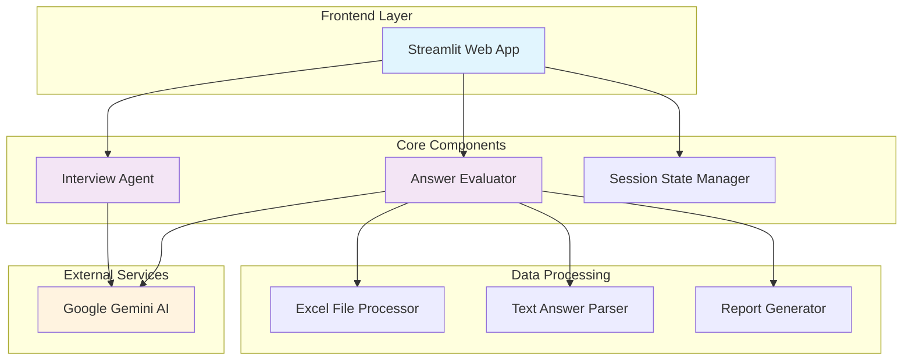
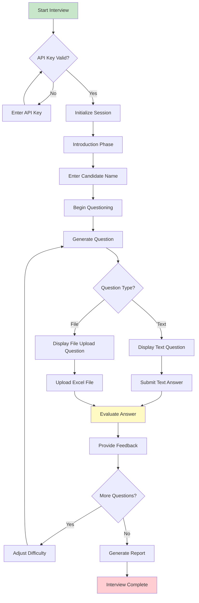
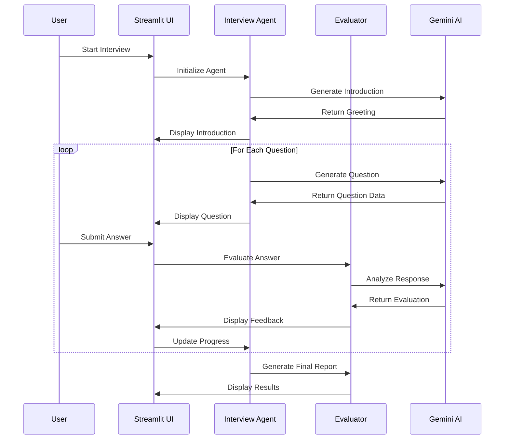
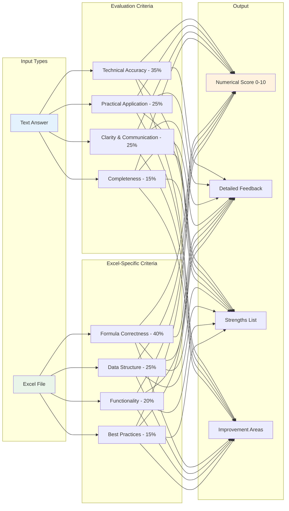
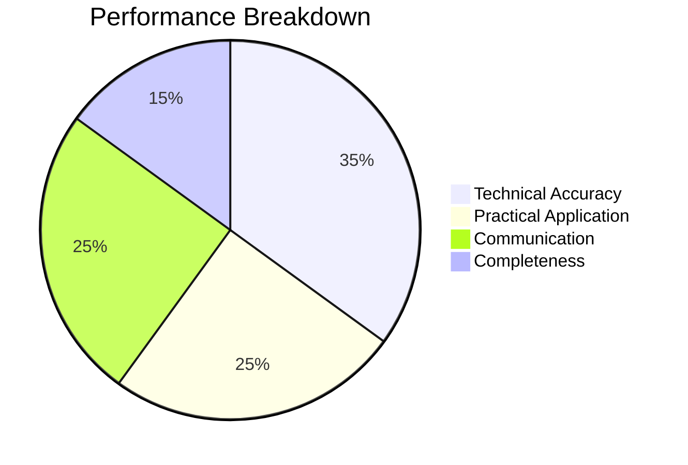
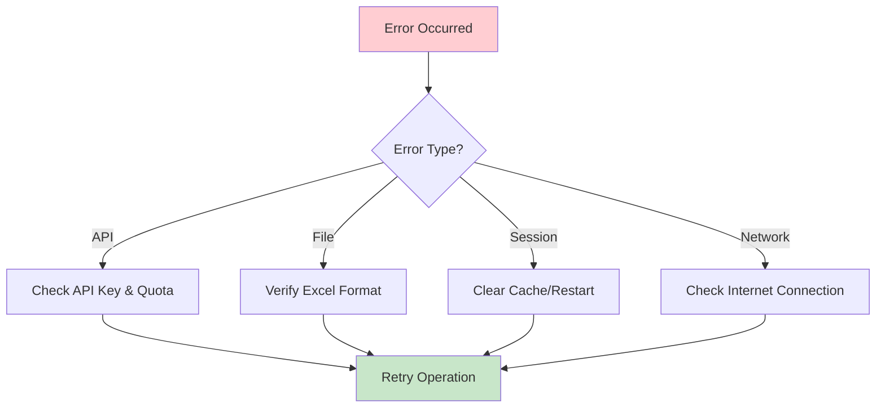

# 📊 Excel Mock Interviewer

An AI-powered mock interview system for assessing Excel skills using Google's Gemini AI. This application provides an interactive interview experience with real-time evaluation, file upload capabilities, and comprehensive performance reporting.

## 🚀 Features

- **AI-Powered Interviews**: Dynamic question generation using Google Gemini AI
- **Multi-Format Support**: Text answers and Excel file uploads
- **Adaptive Difficulty**: Questions adjust based on performance
- **Real-Time Evaluation**: Instant feedback and scoring
- **Comprehensive Reports**: Detailed performance analysis
- **Interactive UI**: Streamlit-based web interface

## 🏗️ System Architecture



## 🔄 Interview Flow



## 🧩 Component Interaction



## 📊 Evaluation System



## 🛠️ Installation

### Prerequisites

- Python 3.12 or higher
- Google Gemini API key
- UV package manager (recommended) or pip

### Quick Start

1. **Clone the repository**

   ```bash
   git clone <repository-url>
   cd coding-ninja
   ```
2. **Install dependencies**

   ```bash
   uv sync
   ```
3. **Set up environment variables**

   ```bash
   # Create .env file
   echo "GOOGLE_API_KEY=your_gemini_api_key_here" > .env
   ```
4. **Run the application**

   ```bash
   # Using UV
   uv run streamlit run app.py

   # Or using Python directly
   streamlit run app.py
   ```

## 🔧 Configuration

### Environment Variables

| Variable           | Description           | Required |
| ------------------ | --------------------- | -------- |
| `GOOGLE_API_KEY` | Google Gemini API key | Yes      |

### Interview Settings

The interview can be customized through the sidebar:

- **Number of Questions**: 3-10 questions
- **Starting Difficulty**: Easy (1) to Expert (5)
- **Question Types**: Text-only or Mixed (text + file uploads)

## 📁 Project Structure

```
coding-ninja/
├── app.py              # Main Streamlit application
├── agent.py            # Interview agent and question generation
├── evaluation.py       # Answer evaluation and scoring system
├── pyproject.toml      # Project configuration and dependencies
├── README.md           # This file
└── .env               # Environment variables (create this)
```

## 🎯 Usage Examples

### Basic Interview Flow

1. **Start**: Enter your Gemini API key in the sidebar
2. **Configure**: Set interview parameters (questions, difficulty)
3. **Begin**: Click "Start Interview" and enter your name
4. **Answer**: Respond to questions via text or file upload
5. **Review**: Get instant feedback after each answer
6. **Complete**: Receive comprehensive performance report

### Question Types

**Text Questions**: Conceptual questions about Excel features

- Example: "Explain the difference between VLOOKUP and INDEX-MATCH"

**File Upload Questions**: Practical Excel tasks

- Example: "Create a pivot table from the provided dataset"

## 📈 Performance Metrics

The system tracks multiple performance indicators:



### Scoring Scale

- **9-10**: Expert level performance
- **7-8**: Advanced proficiency
- **5-6**: Intermediate level
- **3-4**: Beginner level
- **0-2**: Needs significant improvement

## 🔗 Dependencies

- **streamlit**: Web application framework
- **langchain-google-genai**: Google Gemini AI integration
- **pandas**: Data manipulation and analysis
- **openpyxl**: Excel file processing
- **python-dotenv**: Environment variable management

## 🚨 Troubleshooting

### Common Issues

1. **API Key Error**: Ensure your Gemini API key is valid and has sufficient quota
2. **File Upload Issues**: Check file size limits and Excel format compatibility
3. **Session State Problems**: Clear browser cache or restart the application

### Error Messages


